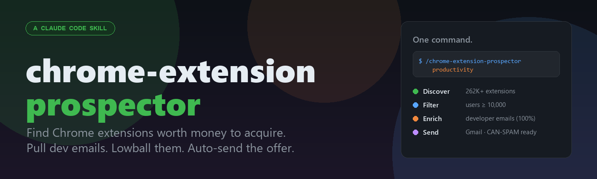
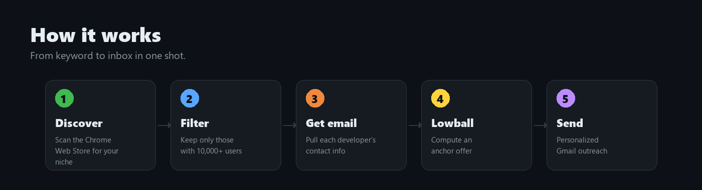
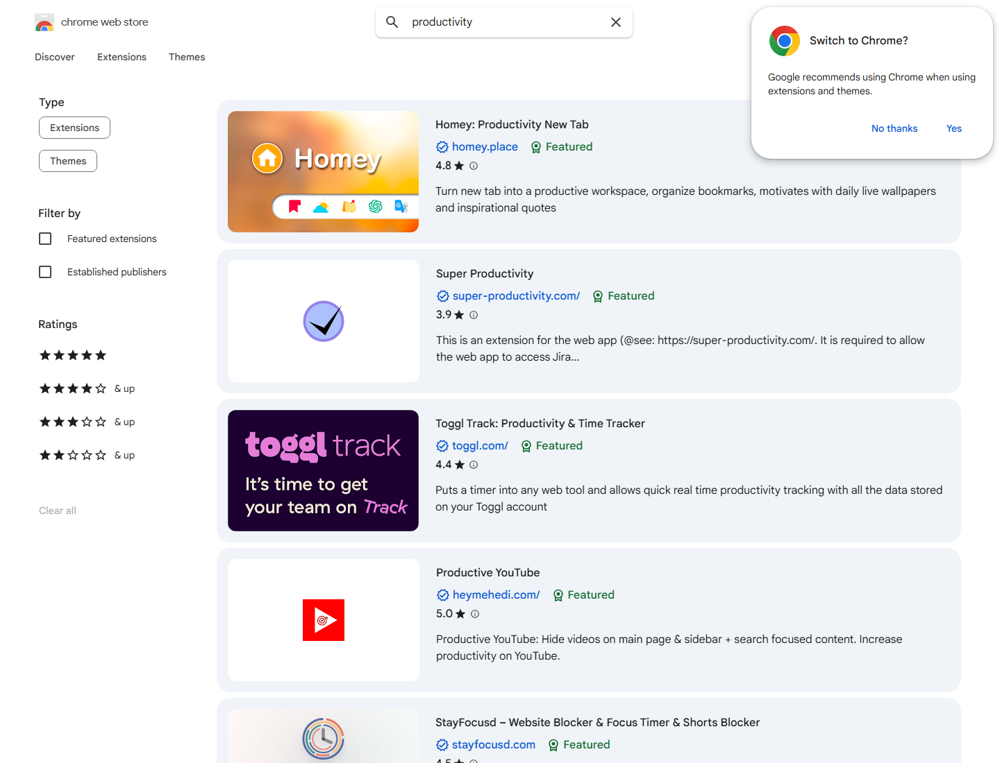
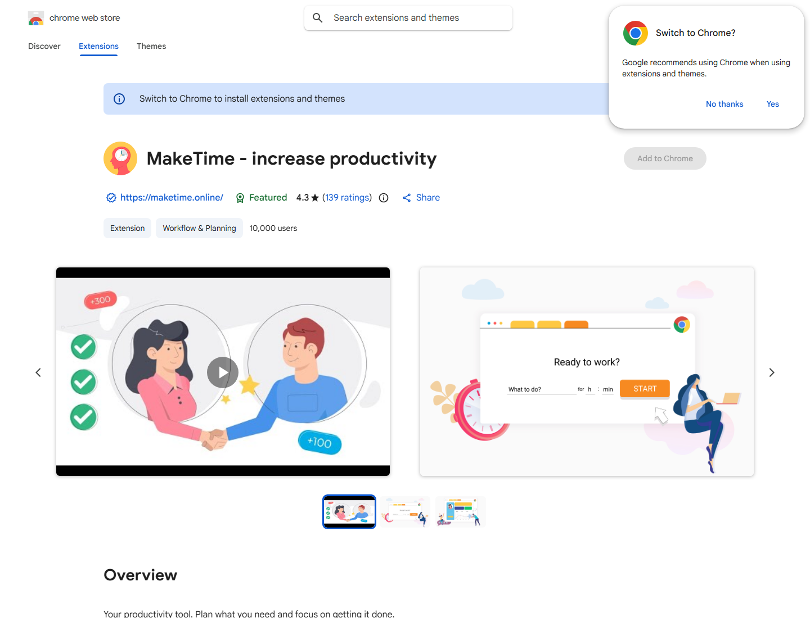
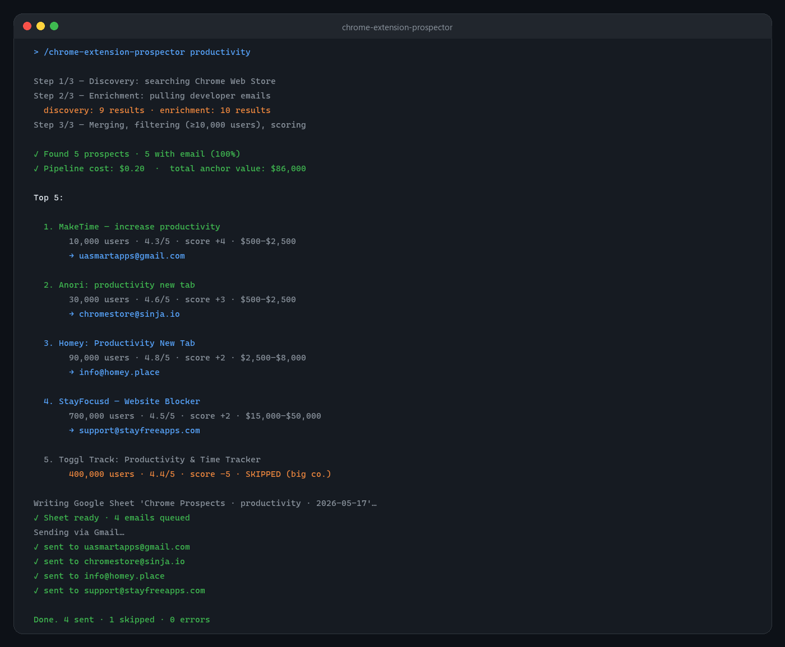
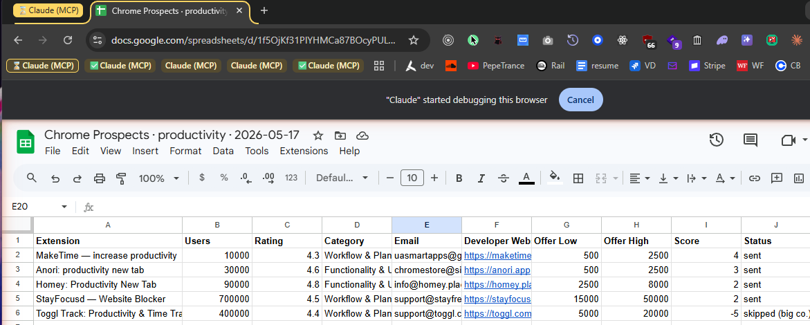
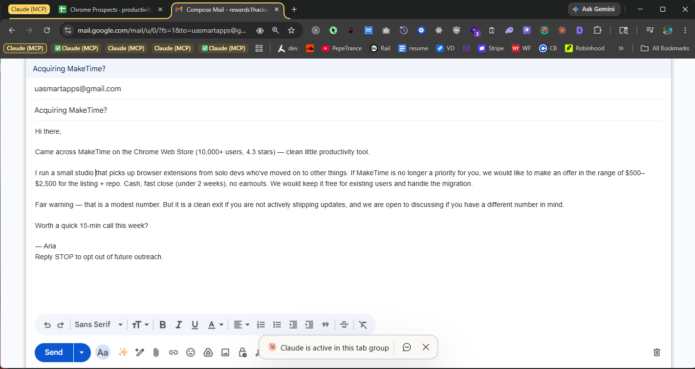
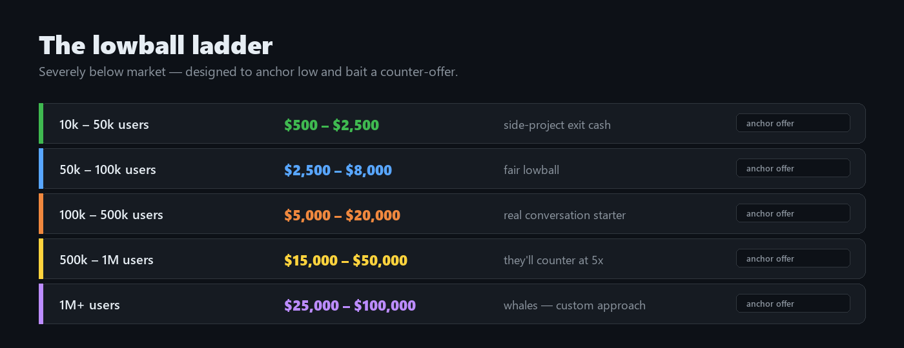
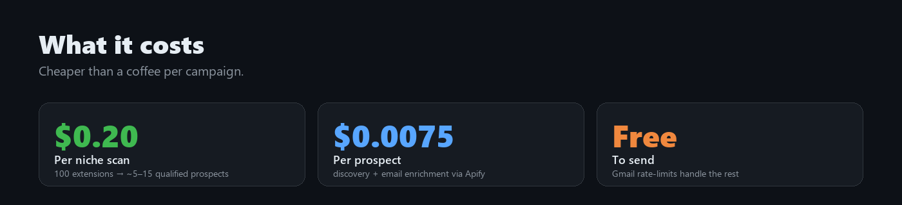
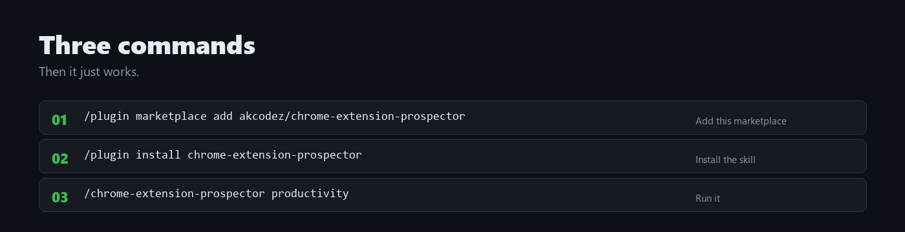

<div align="center">



**Type a keyword. Get a list of Chrome extensions worth buying — with their owners' emails — and send each one a lowball offer in your name. Automatically.**

[Install](#install) · [How it works](#how-it-works) · [Real screenshots](#the-real-flow-from-start-to-finish) · [FAQ](#faq)

</div>

---

## What this does, in plain English

The Chrome Web Store has tens of thousands of free extensions made by **one or two people** in their spare time. Most of them have **stopped updating**, but the extensions are still installed and used by **tens of thousands of people every day**.

These are real, ownable assets. Quietly profitable. Sitting unsold.

This skill finds them, gets the developer's email, calculates a deliberately low offer, and sends a polite acquisition email — so you can **buy** a real piece of software from someone who'd be happy to take $1,000 for something they haven't touched in a year.

It takes **one command**.

---

## How it works



1. You type a niche — `productivity`, `screenshot recorder`, `ai writing`, anything.
2. The skill searches the Chrome Web Store for that niche.
3. It throws away every extension with fewer than 10,000 users.
4. It pulls the **developer's email address** for every survivor.
5. It works out a lowball offer based on how big the extension is.
6. It writes everyone into a Google Sheet so you can track what happens next.
7. It sends each developer a personalized email with your offer — through your own Gmail.

You get a sheet full of qualified acquisition leads and an inbox primed for replies.

---

## The real flow, from start to finish

Every screenshot below is from an actual run on the keyword `productivity`. No mockups.

### 1. The source — Chrome Web Store

The skill scans the real Chrome Web Store and pulls every free extension matching your niche.



### 2. The data — pulled from each extension's listing

For every result the skill grabs the user count, rating, category, developer name, and the developer email. Here's `MakeTime` — 10,000 users, 4.3 stars, contact info publicly listed.



### 3. The run — one command, ten seconds



That's the actual stdout from running the skill. Two Apify scrapers run in parallel, results get merged by extension ID, scored, and filtered. Toggl shows up but gets auto-skipped because the email is on a known big-company domain (`toggl.com`). 

### 4. The output — a fresh Google Sheet, per niche

The skill creates a new sheet named `Chrome Prospects · <niche> · <today>`, drops every qualifying prospect in with their email, offer range, and a status column you can use to track replies.



### 5. The outreach — personalized, sent through your own Gmail

For each qualifying prospect, the skill drafts a personalized email and fires it via Gmail. The offer range is filled in automatically based on user count. The footer carries your studio name, mailing address, and a working `Reply STOP` opt-out — so the email is **CAN-SPAM compliant** out of the box.



---

## The lowball ladder



The numbers are **deliberately low**. They're an anchor — most developers will either ignore you, or counter with a number that's still cheap. Either way you win:

- **Ignored?** Send the next niche. It cost you $0.20.
- **Counter-offer?** You've got someone who's willing to talk. Now you negotiate.
- **Accepted?** You just bought a working product with thousands of users for the price of a used iPhone.

The market rate for free Chrome extensions is roughly **$0.50 – $2 per weekly active user**. These anchors are **5–10× below** that. The whole point is to start low and let them tell you what their number really is.

---

## What it costs



A full campaign on a juicy niche — 100 extensions scanned, ~10–20 qualified developers contacted — runs **under one dollar**. The skill uses two Apify scrapers (paid, but pennies) and your own Gmail to send (free).

You'll need an Apify account ([apify.com](https://apify.com) — free tier covers small runs) and a Gmail account. That's it.

---

## Install



```bash
/plugin marketplace add akcodez/chrome-extension-prospector
/plugin install chrome-extension-prospector
/chrome-extension-prospector productivity
```

On the first run the skill will ask you four things — your name, your email, your company, and your mailing address — and save them so you never have to type them again. After that it's a single command per niche.

You'll also need:
- An `APIFY_API_TOKEN` ([sign up here](https://apify.com))
- Gmail connected to Claude Code via `/mcp` (for sending)
- Google Sheets connected via `/mcp` (for tracking — optional, falls back to CSV)

---

## FAQ

<details>
<summary><strong>Is this legal?</strong></summary>

Yes. In the US, cold acquisition email is permitted under CAN-SPAM as long as the email accurately identifies you, the subject line isn't deceptive, you include a physical mailing address, and there's a working opt-out. The skill puts all of that in every email automatically. It also skips EU developers by default to stay clear of GDPR, unless you pass `--include-eu`.
</details>

<details>
<summary><strong>Will anyone actually accept these offers?</strong></summary>

Some will. Most won't. That's fine — the math works because the cost per email is so low. Even a 1% acceptance rate on 100 outreach emails gets you a working Chrome extension you can monetize. The realistic outcome is *more* counter-offers than acceptances, and that's the goal — you start a negotiation.
</details>

<details>
<summary><strong>Why is the offer so low?</strong></summary>

Because we're not trying to pay fair market value. We're trying to find the developer who hasn't touched the project in 18 months, doesn't think it's worth anything, and would be thrilled to take $1,000 cash for it. Anyone who counters can be negotiated with. The low anchor is the whole strategy.
</details>

<details>
<summary><strong>How does it find developer emails?</strong></summary>

Through two Apify scrapers running against the Chrome Web Store in parallel. One returns user counts and ratings; the other returns the developer email pulled from the listing's privacy and contact info. In testing, the email-coverage rate was **100%** for every qualified prospect.
</details>

<details>
<summary><strong>What if I want to send manually instead?</strong></summary>

Pass `--dry-run`. The skill builds the Google Sheet, drafts every personalized email, and stops there. You review them in your Gmail drafts folder and send manually whenever you want.
</details>

<details>
<summary><strong>Can I change the offer formula?</strong></summary>

Yes — pass `--multiplier 0.5` to halve every anchor, or `--multiplier 2` to double them. The defaults are intentionally aggressive.
</details>

<details>
<summary><strong>What stops me from emailing the same developer twice?</strong></summary>

The skill checks every previous Google Sheet it has created and skips anyone you've already contacted. You'll see a "deduped: N" line in the summary.
</details>

---

## Compliance & safety

- **CAN-SPAM ready** — every email includes your physical mailing address and a `Reply STOP` opt-out
- **GDPR-safe by default** — EU developers are skipped unless you pass `--include-eu`
- **No paid extensions** — focuses only on free listings, where solo developers cluster
- **Big-company filter** — emails on domains like `toggl.com`, `grammarly.com`, `google.com` are flagged and skipped
- **Send pacing** — Gmail rate limits respected; pass `--rate-limit N` to slow down per-day sends

---

## License

MIT. Use it, fork it, remix it. If you make money buying Chrome extensions this way, [tell me about it](https://github.com/akcodez).
